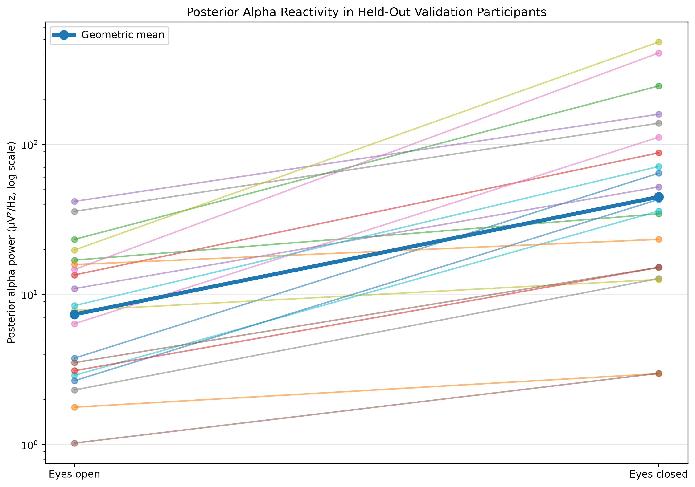

# Reproducible EEG Preprocessing and Spectral Analysis Pipeline

A reproducible analysis of resting-state EEG using the open PhysioNet EEG Motor Movement/Imagery Dataset (EEGMMIDB), implemented in Python with MNE-Python.

This project uses the well-established increase in posterior alpha activity during eyes-closed compared with eyes-open resting conditions as a physiological sanity check for an EEG preprocessing and spectral analysis workflow.

The analysis was developed and quality-checked using participants 1–10, after which the pipeline was frozen and applied unchanged to a held-out validation subset of participants 11–30 from the same dataset.

Across all 20 held-out participants, posterior alpha power was higher during eyes-closed than eyes-open recording. The held-out subset showed a median eyes-closed/eyes-open alpha ratio of 5.20× and a geometric mean ratio of 6.06× (95% CI: 3.94–9.32×).



## Dataset and Analysis Design

Data were obtained from the PhysioNet EEG Motor Movement/Imagery Dataset (EEGMMIDB), an openly available EEG dataset containing recordings from 109 participants using 64 EEG channels sampled at 160 Hz.

For this project, only the resting-state recordings were analysed:

- **Run 1:** 1-minute eyes-open resting EEG
- **Run 2:** 1-minute eyes-closed resting EEG

Participants 1–10 were used as a development and quality-control subset. This stage was used to inspect signal characteristics, evaluate preprocessing decisions, examine potential artefacts, and establish the analysis pipeline.

The resulting pipeline was then frozen and applied without further participant-specific modification to participants 11–30 as a held-out validation subset. This separation was used to reduce the risk of tailoring analytical decisions to the final evaluation participants; it does not constitute external validation because both subsets originate from the same dataset.

## Preprocessing and Spectral Analysis

The analysis was implemented in Python using MNE-Python. For each participant, the eyes-open and eyes-closed recordings were processed using the same pipeline:

1. EEGBCI channel labels were standardised to match MNE montage nomenclature.
2. A `standard_1005` electrode montage was applied.
3. Continuous EEG was band-pass filtered from 1–40 Hz using MNE's default zero-phase FIR filtering.
4. EEG signals were re-referenced to the average reference.
5. Power spectral density was estimated using Welch's method with 2-second windows (`n_fft = 320`, `n_per_seg = 320` at 160 Hz).
6. Posterior alpha activity was quantified over six posterior electrodes: O1, Oz, O2, PO3, POz, and PO4.
7. Mean spectral power density within the 8–12 Hz alpha band was calculated separately for eyes-open and eyes-closed recordings.
8. Alpha reactivity was summarised using the eyes-closed/eyes-open power ratio and percentage change.

The frequency with maximum spectral power within 8–12 Hz was also recorded for each condition. This measure is described as the **alpha-band maximum frequency** rather than an individual alpha peak frequency, because no independent peak-detection criterion was imposed.

## Quality Control and Artefact Handling

Quality control was performed during pipeline development using participants 1–10. Particular attention was given to large-amplitude transients and to whether preprocessing decisions could systematically influence the eyes-open versus eyes-closed comparison.

For participant 1, several large frontal transients were observed during the eyes-open recording. One prominent event showed a peak-to-peak amplitude of approximately 800 µV at Fp2 and was strongly synchronous across the frontopolar channels. Because the dataset does not include a dedicated EOG channel, this event could not be definitively classified as an ocular artefact.

As a sensitivity analysis, FastICA was fitted to the participant's continuous eyes-open EEG. One component showed a strongly frontopolar spatial distribution and a time course corresponding to the large frontal transient. Excluding this candidate ocular component reduced the transient peak-to-peak amplitude by approximately 71–73% at Fp1/Fp2.

Importantly, posterior alpha power was minimally affected by this correction: eyes-open posterior alpha changed from 21.11 to 21.84 µV²/Hz, while the eyes-closed/eyes-open alpha ratio changed from 21.82× to 21.09×.

ICA was therefore retained as an exploratory sensitivity analysis rather than incorporated as an automated preprocessing step. Without dedicated EOG recordings or a defensible automated component-classification rule, applying ICA systematically across participants could introduce subjective or condition-dependent cleaning decisions.

No participants were excluded on the basis of the magnitude of their alpha response. Development participants with unusually large or weak eyes-closed/eyes-open differences were retained after targeted spectral inspection when there was no clear evidence that their results reflected processing failure.

## Results

### Development Subset

The development and quality-control subset included participants 1–10. Posterior alpha power was higher during eyes-closed than eyes-open recording in all 10 participants.

The median eyes-closed/eyes-open alpha ratio was **10.36×**. Because alpha-power ratios were strongly right-skewed, log-transformed ratios were also summarised. The geometric mean ratio was **8.11×** (95% CI: **3.21–20.49×**).

A predefined one-sided Wilcoxon signed-rank test evaluating the expected direction of greater posterior alpha power during eyes-closed recording yielded **W = 55.0, p < .001**.

### Held-Out Validation Subset

The frozen pipeline was subsequently applied to participants 11–30. All **20/20 held-out participants** again showed greater posterior alpha power during eyes-closed than eyes-open recording.

The median eyes-closed/eyes-open alpha ratio was **5.20×**, with an interquartile range of **3.59–13.34×**. The geometric mean ratio was **6.06×** (95% CI: **3.94–9.32×**).

The corresponding one-sided Wilcoxon signed-rank test yielded **W = 210.0, p < .001**.

Although the magnitude of alpha reactivity varied substantially between individuals, its direction was consistent across both subsets. The smaller geometric mean ratio in the held-out subset also illustrates why the development results should not be treated as an unbiased estimate of effect magnitude.

Overall, the held-out analysis reproduced the expected physiological contrast without further modification of the preprocessing or spectral-analysis pipeline.

## Repository Structure

```text
EEG Project 1/
├── data/
├── figures/
│   └── held_out_validation_alpha_reactivity.png
├── notebooks/
│   └── 01_eeg_exploration.ipynb
├── results/
│   └── alpha_results_subjects_1_30.csv
└── README.md
```

The repository does not include raw EEG recordings. EEGMMIDB data are retrieved programmatically through MNE-Python from PhysioNet, allowing the analysis to be reproduced without redistributing the source EDF files.

The `notebooks` directory contains the exploratory analysis and development of the reusable preprocessing and spectral-analysis pipeline. The `results` directory contains participant-level derived alpha metrics for the 30 analysed participants, while final visualisations are stored in `figures`.

## Reproducibility

The analysis was designed so that the same preprocessing and spectral-analysis functions could be applied consistently across participants. Raw data are loaded using participant identifiers and the relevant EEGBCI run numbers rather than manually selected local files.

A fixed analysis function performs channel-name standardisation, montage assignment, 1–40 Hz filtering, average referencing, Welch spectral estimation, posterior-region selection, and alpha-band metric extraction.

Randomness was not involved in the primary spectral-analysis pipeline. ICA was used only as an exploratory sensitivity analysis for participant 1 and was not part of the frozen multi-participant pipeline.

## Limitations

This project was designed as a small reproducible EEG analysis and technical portfolio exercise rather than a definitive investigation of resting-state alpha physiology.

Several limitations should therefore be considered:

- **Same-dataset validation:** The development and held-out subsets were drawn from the same EEGMMIDB dataset. Participants 11–30 provide a held-out evaluation of the frozen pipeline, but this should not be interpreted as external validation.

- **Limited sample size:** The analysis included 30 of the 109 participants available in EEGMMIDB. The objective was to demonstrate development, quality control, reproducible implementation, and held-out evaluation rather than to obtain the most precise population estimate of alpha reactivity.

- **No dedicated EOG recording:** Potential ocular artefacts could not be independently identified using dedicated electrooculography. ICA-based inspection was therefore treated as an exploratory sensitivity analysis rather than incorporated into the automated pipeline.

- **Minimal automated artefact rejection:** The frozen pipeline deliberately avoided participant-specific amplitude thresholds or subjective ICA component removal. This improves consistency across conditions but means that residual artefacts may remain in individual recordings.

- **Alpha-band definition:** Alpha activity was defined using a fixed 8–12 Hz frequency range. Individual variation in alpha frequency was not explicitly modelled.

- **Alpha-band maximum frequency:** The frequency with maximum power within 8–12 Hz was recorded descriptively, but should not be interpreted as a formally estimated individual alpha frequency because no independent peak-detection criterion was applied.

- **Single physiological contrast:** The analysis evaluates one established EEG phenomenon—eyes-closed enhancement of posterior alpha activity. Successful recovery of this contrast provides a useful pipeline sanity check but does not establish validity for other EEG paradigms, frequency bands, or clinical applications.

## What This Project Demonstrates

This project was developed as a practical introduction to reproducible EEG analysis using open electrophysiological data. It demonstrates experience with:

- accessing and working with open EEG data programmatically;
- preprocessing continuous EEG using MNE-Python;
- electrode montage assignment and EEG re-referencing;
- frequency-domain analysis using Welch power spectral density estimation;
- region-of-interest and frequency-band analysis;
- exploratory ICA-based artefact assessment;
- physiological and visual quality control;
- development-versus-held-out evaluation of an analysis pipeline;
- participant-level data aggregation and statistical comparison;
- reproducible scientific programming and transparent documentation.

The project also illustrates the importance of distinguishing exploratory analytical decisions from a subsequently frozen pipeline, retaining inter-individual variability rather than excluding unexpected results solely on the basis of outcome magnitude, and communicating methodological limitations explicitly.

## Data Source and Citation
Data were obtained from the **EEG Motor Movement/Imagery Dataset (EEGMMIDB), version 1.0.0**, hosted by PhysioNet.

**Recommended citation:**

Schalk, G. (2009). *EEG Motor Movement/Imagery Dataset* (version 1.0.0). PhysioNet. RRID:SCR_007345. https://doi.org/10.13026/C28G6P

The dataset files are distributed under the **Open Data Commons Attribution License v1.0**. Raw EEG recordings are not redistributed in this repository; they are retrieved programmatically through MNE-Python.